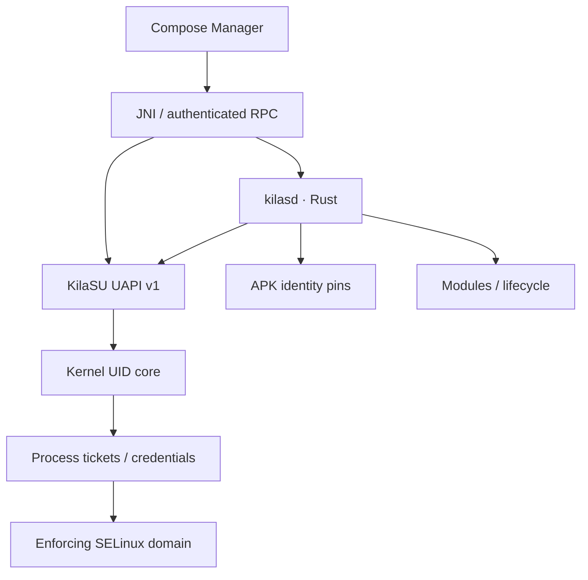

# KilaSU

**Modern Kernel Root Framework for Android**

[](https://github.com/takamoresishei/KilaSu/actions/workflows/build-manager.yml)
[](https://github.com/takamoresishei/KilaSu/actions/workflows/build-daemon.yml)
[](https://github.com/takamoresishei/KilaSu/actions/workflows/build-kernel-test.yml)

KilaSU is an independent kernel authorization core, versioned UAPI, Rust daemon,
module engine, boot-container patcher, recovery installer, and Kotlin/Compose
Manager. It uses its own namespaces and protocol; it is not a renamed upstream
root framework. Manager uses real captured-backdrop blur through Haze, frosted
tint, reflection borders, a glass navigation bar, and a short Compose opening.

**Current version: 0.1.0 development.** Host components have executable tests and
kernel compile checks. Root execution, enforcing ROM policy, boot lifecycle,
and recovery flashing still require device validation. No stable v1.0.0 or
universal stock-device compatibility is claimed. See [validation](docs/validation.json)
and [milestones](docs/milestones.md) for the precise boundary.

## Manager

Home reads the kernel and daemon instead of presenting synthetic “Working” data.
Superuser changes use authenticated daemon RPC and kernel-enforced UID rules.
Modules supports actual ZIP installation, staged updates and lifecycle scripts.
Settings controls appearance and exports real diagnostics. APK package:
`io.github.kilasu.manager`.

An emulator screenshot of the actual disconnected app is generated by the
[Manager workflow](https://github.com/takamoresishei/KilaSu/actions/workflows/build-manager.yml)
as `manager-screenshot`. The emulator does not contain KilaSU and correctly
shows “Not Installed”.

## Architecture



Root starts denied. An approved application requests a short-lived, single-use
ticket from the daemon. The daemon checks the live package/UID/APK identity and
the approved profile. The kernel binds the ticket to the actual task, verifies
its UID and profile again, and commits credentials only after SELinux accepts
the configured KilaSU domain. A transferred device descriptor does not transfer
authorization. Manager APK enrollment is performed by the privileged daemon;
app self-enrollment is rejected.

## Targets

| Component | Target | Validation |
|---|---|---|
| Kernel | arm64 ACK 5.10 / 5.15 / 6.1 | CI compile matrix; runtime pending |
| Manager | Android 12+ / API 31+ | Build, unit tests, emulator screenshot CI |
| Daemon | aarch64-linux-android / API 31+ | Host tests, NDK cross-build CI |
| Boot image | GKI headers 3 and 4, Image / Image.gz | Host parser/repack tests |
| Legacy boot | Headers 0–2 | Analysis only; no repack |
| Recovery | arm64 update-binary environments | Script checks; device flash pending |

Android version alone does not establish compatibility. Kernel ABI, vendor
modules, partition image size, ROM SELinux policy, and init ordering matter.

## Installation

1. Integrate `kernel/selinux/` policy and `examples/kilasu.rc` into a source-built
   ROM; install the matching `kilasd` and `kila` binaries into the ROM.
2. Integrate KilaSU into that device's compatible ACK kernel and compile with
   `CONFIG_KILASU=y`. Preserve its exact kernel release and vendor ABI.
3. Build a payload pinned to the kernel blob from the original boot image.
4. In Manager select `boot.img` and the device payload, patch, inspect the
   checksum/log, then export `KilaSU-patch.zip`.
5. Place the bundle at `/sdcard/KilaSU/KilaSU-patch.zip`, install the matching
   official Installer ZIP in recovery, read the verification log, and reboot
   manually. Keep the Uninstaller and verified backup.

Manager only patches and exports. The current patcher replaces a compiled
kernel inside a validated boot container, preserves the ramdisk, and requires
preexisting ROM policy/init integration. It cannot turn an arbitrary proprietary
kernel into KilaSU by attaching a userspace binary.

Read [installation](docs/installation.md), [boot patching](docs/boot-patching.md),
and [recovery installation](docs/recovery-installation.md).

## Kernel integration

```sh
git clone --depth 1 --branch android12-5.10 https://github.com/aosp-mirror/kernel_common.git kernel_source
git clone https://github.com/takamoresishei/KilaSu.git KilaSU
./KilaSU/scripts/setup.sh kernel_source
```

The same integration supports `android13-5.15` and `android14-6.1`. It copies
the independently licensed kernel/UAPI source, adds marked Kconfig/Makefile
entries, refuses unknown existing directories, and can be rerun. Review
[kernel integration](docs/kernel-integration.md) before building a device image.

## Building

```sh
./scripts/build.sh host          # Rust, ABI, boot parser, integration tests
./scripts/build.sh manager       # Android SDK, NDK, Java 17 required
KERNEL_TREE=/path/to/ack ./scripts/build.sh kernel
```

The repository contains separate Manager, daemon, kernel, recovery and release
workflows. A stable tag such as `v1.0.0` requires matching versions, an actual
device validation report and a persistent release signing key. It builds APK,
Installer, Uninstaller and checksums and publishes GitHub Release notes.
[Build instructions and signing](docs/building.md).

## Documentation

[Architecture](docs/architecture.md) · [UAPI](docs/uapi.md) · [Daemon](docs/daemon.md) ·
[Modules](docs/modules.md) · [App profiles](docs/app-profile.md) · [SELinux](docs/selinux.md) ·
[Security](docs/security.md) · [Porting](docs/porting.md) · [Troubleshooting](docs/troubleshooting.md)

## Contributing and license

See [CONTRIBUTING](CONTRIBUTING.md), [SECURITY](SECURITY.md) and
[CODE_OF_CONDUCT](CODE_OF_CONDUCT.md).

Kernel: **GPL-2.0-only** (`kernel/LICENSE`). UAPI: **GPL-2.0-only WITH
Linux-syscall-note**. Manager, userspace, boot patcher and tooling:
**GPL-3.0-only** (`LICENSE`), compatible with their Apache-2.0 dependencies.
Third-party code/dependencies and architectural references are identified in
[THIRD_PARTY_NOTICES](THIRD_PARTY_NOTICES.md). Distributing modified kernels
requires their corresponding complete source, configuration and notices.
